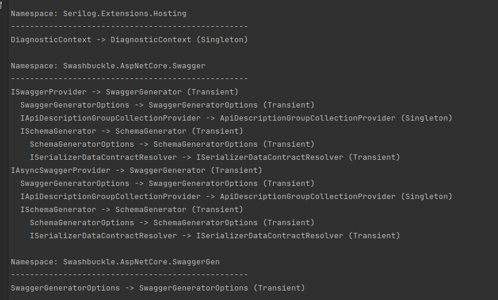

# DependencyInjection.Visualization

This library provides types for visualizing and analyzing dependency injection trees in .NET applications. It helps identify deep dependency chains and presents your solution's architecture in an intuitive way.

### Quickstart

```csharp
using JKendall.DependencyInjection.Visualization;
using Microsoft.Extensions.DependencyInjection;

// Setup your services
var services = new ServiceCollection();
services.AddTransient<IService1, Service1>();
services.AddSingleton<IService2, Service2>();

// Create a DependencyTree
var tree = new DependencyTree(services);

// Generate and print the full tree
Console.WriteLine(tree.GenerateTreeString());

// Generate and print only user code (excluding framework services)
Console.WriteLine(tree.GenerateTreeString(onlyUserCode: true));

// Find and analyze dependency chains of depth 4 or more
var deepChains = tree.GetRegistrationChainsByDepth(4, onlyUserCode: true);

Console.WriteLine($"Found {deepChains.RootNodes.Count} deep chains:");
Console.WriteLine(deepChains.StringRepresentation);
```

## Example output



## Installation

Install via NuGet:

`dotnet add package JKendall.DependencyInjection.Visualization`

## Considerations

This library uses reflection to build the tree of dependencies in your IServiceProvider.

I recommend running it behind a debug flag:

```csharp
var app = builder.Build();

if (app.Environment.IsDevelopment())
{
    var tree = new DependencyTree(builder.Services);

    // ...
}
```

## Contributing
Contributions are welcome. Please feel free to submit a pull request or issue if a feature you want is missing.

## License
This project is licensed under the MIT License.