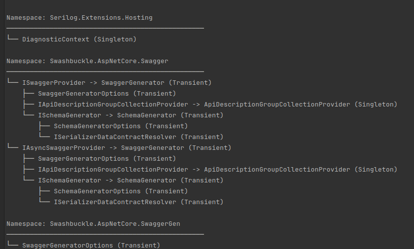

# DependencyInjection.Visualization

This library provides types for visualizing dependency hierarchies in `Microsoft.Extensions.DependencyInjection`'s `IServiceCollection`. It presents your solution's architecture in an intuitive way, helps identify deeply-nested dependency chains, and can find services which are unused, despite being registered.

### Quickstart

```csharp
using JKendall.DependencyInjection.Visualization;
using Microsoft.Extensions.DependencyInjection;

// Setup your services.
var services = new ServiceCollection();
services.AddTransient<IService1, Service1>();
services.AddSingleton<IService2, Service2>();

// Handles open generic registrations.
services.AddSingleton(typeof(IFoobar<,,>), typeof(Foobar<,,>));

// Quickly see the hierarchy of your IServiceCollection via an extension method.
Console.WriteLine(services.GetDebugView());

// For more control, create a DependencyTree.
// You can filter the tree to only include services defined in
// the currently-executing assembly and those it references.
var tree = new DependencyTree(services, onlyUserCode: false);

// Generate and print the full tree.
Console.WriteLine(tree.GenerateTreeString());

// Find deeply-nested dependency chains.
var deepChains = tree.GetRegistrationChainsByDepth(4);

Console.WriteLine($"Found {deepChains.RootNodes.Count} deep chains:");
Console.WriteLine(deepChains.StringRepresentation);

// See what services are used most frequently...
var topFiveMostUsed = tree.GetMostUsedServices(5);

// ...and which are never used, despite being registered.
var unused = tree.GetUnusedServices();
```

## Example output



## Installation

Install via NuGet:

`dotnet add package JKendall.DependencyInjection.Visualization`

## Contributing
Contributions are welcome. Please feel free to submit a pull request or issue if a feature you want is missing.

This project was developed in concert with Claude 3.5 Sonnet, from Anthropic.

## License
This project is licensed under the MIT License.